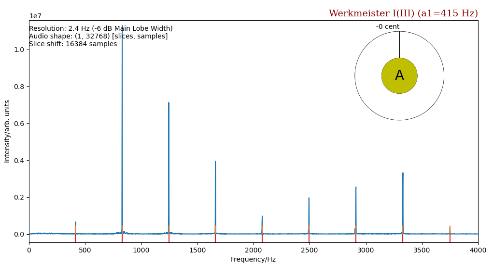

# Harpsichord & Piano Tuning

### Introduction

We present here an automatic tuning tool for string instruments, 
e.g. harpsichords and pianos.

The current application (exclusively realized in Python) 
collects a mono signal from the computer's input audio stream (USB connector),
splits it into smaller, overlapping slices, and applies the Fourier transform to
each. This practice is known as short time Fourier transform, i.e. STFT. 
The slices overlap by multiples of 1024 samples. They have sizes of
L = 2N samples, where N=15 or 16, resulting in sampling 
periods of 0.74 or 1.49 s each slice. 
The sampling frequency is fs = 44,100 s-1

Each slice is apodized utilizing Gaussian windowing, where L = 
7&sigma;, resulting in a FWHM (@-6dB) = 2.62 bins and a full width 
of the main lobe of 
10.46 bins. This translates to 3.53 or 1.76 Hz and 14.1 or 7.1 Hz for N = 15 and 
16, respectively. The highest side lobe is -71 dB. Worth mentioning, the 
Gaussian L = 7&sigma; is similar to a Blackman-Harris-Nuttall window.

Subsequently, in the
frequency domain, Butterworth high-pass filtering is applied to suppress noise
at the bottom side, before fundamental and overtone frequencies are sought.
In order to achieve the highest accuracy in their positions, we fit a 
parabola - by three-node interpolation - to the
logarithm of the Gaussian in Fourier space, for the
strongest NMAX peaks found. The parabola centroids are utilized to derive 
the frequency f0 and the inharmonicity factor B.

For an ideal string the frequencies of higher partials are just multiples
of the fundamental frequency

**(1) $`f_{n} = n f_{1}\label{eq:test1}`$**

where n is the n<em>th</em> partial. 
The ear hears the fundamental frequency most prominently, 
but the overall sound is also colored by the presence of various overtones 
(frequencies greater than the fundamental frequency).
However, a real string behaves closer to a stiff bar according to a forth-order 
differential equation 

**(2) $`\ddot{y} \propto {-y}''''`$** 

with a quadratic dispersion. Hence, its partials can be approximated by

**(3) $`f_{n} = n f_{0} \sqrt{1 + B n^{2}}`$**

All peak positions are correlated to each other, such that they 
can be identifed as higher partials to one common base frequency f0. 
By rewriting (2), we get for two frequencies that can be 
applied to all permutations of peaks

**(4) $`B = C - 1 /over{j^{2} - C * i^{2}}`$**, 
where 
**C = (f_{j} i /over{f_{i} j})^{2}`$**

**(4) <em>f0 = fi / (i * sqrt(1 + B * i2))</em>**

The measured frequencies of the partials are denoted
**<em>fi < fj</em>** and **1 &#8804;
<em>i < j &#8804; NPARTIAL</em>**. 
The maximum inharmonicity coefficient needs to be adjusted in
[parameters.py](https://github.com/Tamburasca/HarpsichordTuning/blob/master/Tuning/parameters.py), 
depending on the instrument to be tuned, B < 0.001 and < 0.05 for 
harpsichords and pianos, respectively. Finally, a synthetic spectrum 
is calculated from f0 and B and compared to the measured 
one by minimizating the L1-norm of the coefficient vector, the coefficients being
<em>abs(fimeasured - ficalculated)</em>.
The L2-norm was tested, but behaved inferior. I employ the module 
[scipy.optimize.slsqp](https://docs.scipy.org/doc/scipy/reference/optimize.minimize-slsqp.html#optimize-minimize-slsqp),
designed for least-square minimizations. Although it requires the Jacobian 
of the L1 to be computed as well - imposing additional CPU-power - it seemed to 
be the most reliable and fastest minimizer, when compared to brute-force or 'L-BFGS-B'.

### Features

The frequency of the first partial f1 is 
compared to a value derived from the pitch level and a tuning table 
[tuningTable.py](https://github.com/Tamburasca/HarpsichordTuning/blob/master/Tuning/tuningTable.py), 
currently comprising Werkmeister III, 1/4 Comma Meantone, and Equal Temperament 
(feel free to edit/enhance it for yourself). We have not yet considered 
enharmonic equivalency in meantone, hence, one would have to enable/disable 
certain keys, 
such as A♭ vs. G#. The key in the center of the pie shows what key was 
pressed and its deviation, in units of cent, for the specified tuning and 
pitch level: too low (in red) and too high (in green).

The orange vertical bars indicate the peaks identified by the peak 
finding routine. The red vertical bars show the partials up to 
<em>nmax &#8804; NPARTIAL</em> as 
derived from the computed base frequency and inharmonicity coefficient 
when applying (2).

The hotkey 'ctrl-y' or 'x' stops the program or toggles between halt and 
resume, respectively. 'Ctrl-j' and 'ctrl-k' shorten and lengthen the shift 
between the audio slices, whereas 'ctrl-n' ('alt-n') and 'ctrl-m' ('alt-m') 
diminish and increase the max (min) frequency displayed. 'ctrl-r' resets 
parameter to initial values.
 
Run the program with: <em>python3 -m Tuning</em>

### Caveat

1) When tuning you may consider preventing the display from blanking, locking 
and the monitor's DPMS (on UNIX) energy saver from kicking in. To date I haven't 
found a decent solution yet that works for all OS flavors equally well. 
Suggestions welcome.

2) On certain Linux distributions, a package named python-tk (or similar) needs 
to be installed, when running in virtual environments.

3) Also note that the module pynput utilized here may encounter 
[plattform limitations](https://pynput.readthedocs.io/en/latest/limitations.html#)

### Results
Owing to the lack of reliable data to date, I refer to results of ref. 4. The 
authors achieve a relative error of a Gaussian interpolation of 0.052% per bin 
for the center frequency of the parabola. This converts to 0.07% for N = 15, 
resulting in an error of 0.29 Hz @ 415 Hz (1.2 cent). Given the fact, though, 
that in the current application the frequency of the first partial is 
derived from a combination of all partials measured, 
its frequency is anticipated to be more precise.
This is achieved through comparparing the measuremed spectrum which that 
calculated from f0 and B by minimizing the L1-norm, such as in 
Compressed Sensing. The vector coeficients are normalized to the frequency, 
because higher partials impose a greater weight on the L1-norm 
than lower partials. In a preliminary test the max. relative error
turned out to be around 1.4 * 10-4 for frequencies and 
7 * 10-3 for B @415Hz.

### References

1) HARVEY FLETCHER, THE JOURNAL OF THE ACOUSTICAL SOCIETY OF AMERICA VOLUME 36,
NUMBER 1 JANUARY 1964
2) HAYE HINRICHSEN, REVISTA BRASILEIRA DE ENSINA FISICA, VOLUME 34, NUMBER 2,
2301 (2012)
3) JOONAS TUOVINEN, SIGNAL PROCESSING IN A SEMI-AUTOMATIC PIANO TUNING SYSTEM
(MA OF SCIENCE), AALTO UNIVERSITY, SCHOOL OF ELECTRICAL ENGINEERING (2019)
4) M. GASIOR, J.L. GONZALEZ, IMPROVING FFT FREQUENCY MEASUREMENT RESOLUTION
BY PARABOLIC AND GAUSSIAN INTERPOLATION, EUROPEAN ORGANIZATION FOR NUCLEAR RESEARCH/
ORGANISATION EUROPEENNE POUR LA RECHERCHE NUCLEAIRE, AB-Note-2004-021 BDI (2004)

#### Contact

Ralf Antonius Timmermann, Email: rtimmermann@astro.uni-bonn.de, 
Argelander Institute for Astronomy (AIfA), University Bonn, Germany.